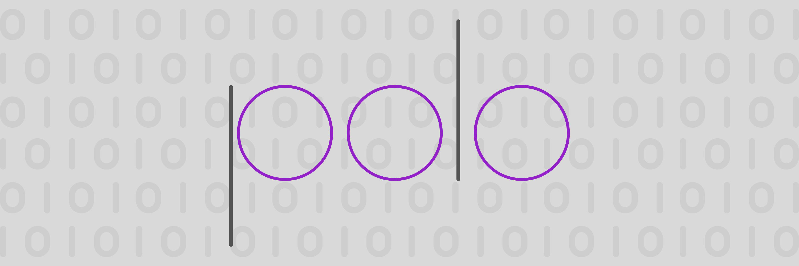

# go-polo
**go-polo** is a Go implementation of the POLO Encoding and Object Serialization Scheme. [**POLO**](https://github.com/sarvalabs/polo) stands for ***Prefix Ordered Lookup Offsets***. 

It is intended for use in projects that prioritize deterministic serialization, minimal wire sizes and serialization safety. POLO follows a very strict specification that is optimized for partial decoding and differential messaging. This implementation is compliant with the [POLO Specification](https://github.com/sarvalabs/polo) that describes both the encoding (wire) format as well as implementation guidelines for several languages.

## Installation
Install the latest [release](https://github.com/sarvalabs/go-polo/releases) using the following command
```sh
go get -u github.com/sarvalabs/go-polo
```

## Features
### Deterministic Serialization
POLO's strict specification is intended to create the same serialized wire for an object regardless of implementation. This is critical for cryptographic security with operations such as hashing which is used to guarantee data consistency and tamper proofing.

### High Wire Efficiency
POLO has a highly optimized wire format allows messages to be relatively small, even surpassing [Protocol Buffers](https://protobuf.dev/programming-guides/encoding/) occassionaly. This is mainly because it supports a larger type based wire tagging that allows some information (especially metadata) to be passed around inferentially and thus reducing the total amount of information actually present in the wire. 

This is augmented by the fact that POLO supports **Atomic Encoding**, because of which simple objects such as integers & strings can be encoded without needing to be wrapped within a larger (structural) message

### Partial Encoding/Decoding Constructs
The POLO wire format prefixes all metadata for the wire in the front, this metadata includes the wire type information as well as the offset position of the data. This kind of *lookup* based offset tags allows us to directly access the data for a particular field order. This capability is currently supported using the `Document` and `Raw` constructs. 

The `Document` construct is used to create a string indexed collection of `Raw` object and it collapses into a special form of the POLO wire called the **document-encoded wire** with the `WireDoc` wire type. It's unique in that it preserves the field name (string index) for the data unlike regular POLO encoding and is similar to encoding schemes like JSON or YAML and consequently consumes more wire space.

The `Raw` construct is useful for capturing the wire data for a specific field in the struct. It can also be used to define a structure that 'skips' the unrequired fields by capturing their raw wire instead of decoding them.

Partial encodign/decoding capabilities for this implementation are unfinished can be extended to support field order based access/write for regular POLO encoded wires in the future.

### Custom Encoding/Decoding Buffers
POLO describes two buffers, `Polorizer` and `Depolorizer` which are write-only and read-only respectively, allowing sequential encoding/decoding of objects and wire elements into them. This capability can be leveraged to implement the `Polorizable` and `Depolorizable` interfaces which describe the custom serialization form for an object.

**Note**: This capability can be dangerous if not implemented correctly, it generally recommended that both interfaces be implemented and are evenly capable of encoding/decoding the same contents to avoid inconsistency. It is intended to be used for object such as Go Interfaces which are not supported by default when using the reflection based `Polorize` and `Depolorize` functions.

### Differential Messaging (Coming Soon)
POLO's partially encoding and field order based indexing (and string based indexing for document encoded wires) allows the possibility for messaging that only allows the transmission of the difference between two states, this is useful for any version managment system where the same data is incrementally updated and transmitted, the ability to index the difference and only transmit the difference can result in massive reduction in the wire sizes for these use cases that often re-transmit already available information.

## Examples
### Simple Polorization & Depolorization (Encoding/Decoding)
https://github.com/sarvalabs/go-polo/blob/cc0fdf369f903655817e8d548074f21db442c039/polo_test.go#L16-L62

### Custom Polorization & Depolorization (Encoding/Decoding)
https://github.com/sarvalabs/go-polo/blob/cc0fdf369f903655817e8d548074f21db442c039/polo_test.go#L64-L170

### Wire Decoding with `Any`
https://github.com/sarvalabs/go-polo/blob/95c01c91e9e3ceabc99d530e78a4f8bedadc13a1/polo_test.go#L172-L207

### `Polorizer` (Encoding Buffer)
https://github.com/sarvalabs/go-polo/blob/cc0fdf369f903655817e8d548074f21db442c039/polorizer_test.go#L12-L40

### `Depolorizer` (Decoding Buffer)
https://github.com/sarvalabs/go-polo/blob/cc0fdf369f903655817e8d548074f21db442c039/depolorizer_test.go#L13-L64

### Document Encoding
https://github.com/sarvalabs/go-polo/blob/cc0fdf369f903655817e8d548074f21db442c039/document_test.go#L12-L70

### Document Decoding
https://github.com/sarvalabs/go-polo/blob/cc0fdf369f903655817e8d548074f21db442c039/document_test.go#L72-L116

## Contributing
Unless you explicitly state otherwise, any contribution intentionally submitted
for inclusion in the work by you, as defined in the Apache-2.0 license, shall be
dual licensed as below, without any additional terms or conditions.

## License
&copy; 2023 MOI Protocol Authors. [dev@sarva.ai]

This project is licensed under either of
- [Apache License, Version 2.0](https://www.apache.org/licenses/LICENSE-2.0) ([`LICENSE-APACHE`](LICENSE-APACHE))
- [MIT license](https://opensource.org/licenses/MIT) ([`LICENSE-MIT`](LICENSE-MIT))   

at your option.

The [SPDX](https://spdx.dev) license identifier for this project is `MIT OR Apache-2.0`.